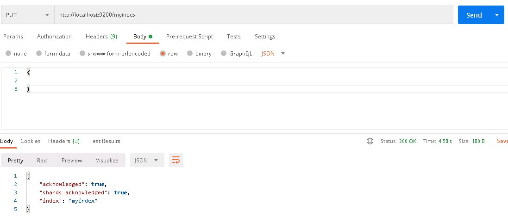
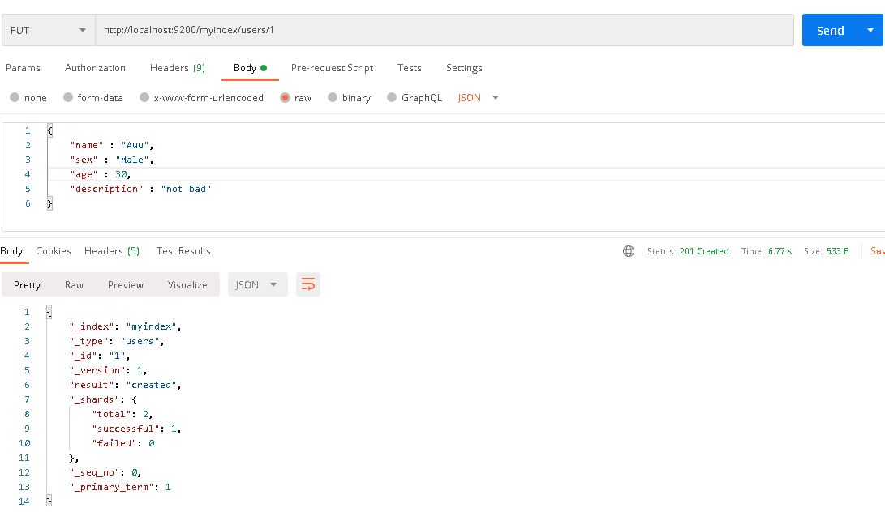
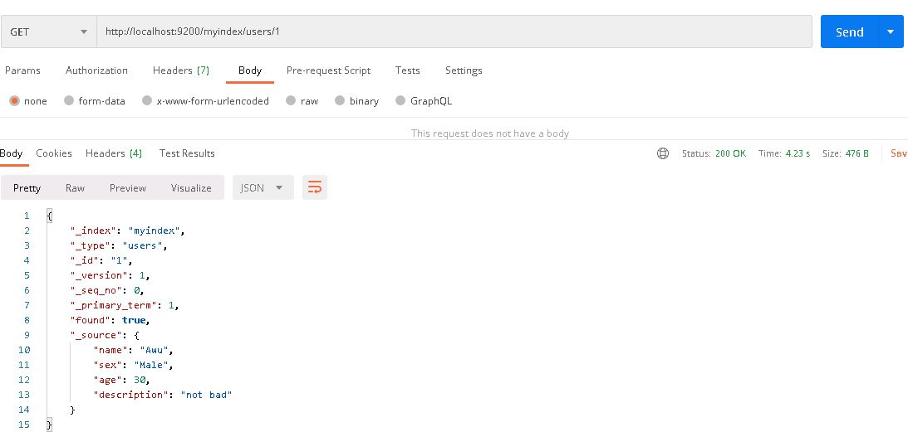
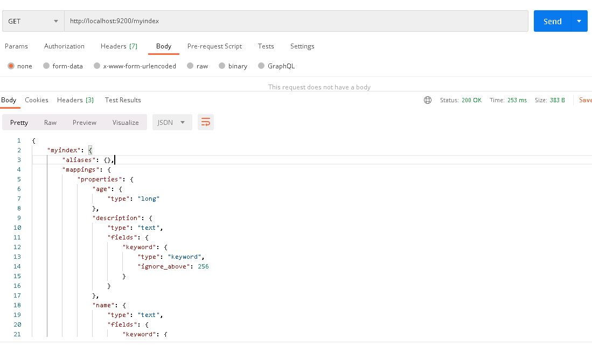

# 基本概念

> 此处使用数据库的概念进行类比

## 核心概念类比

| 概念 | 类比 |
| ---- | ---- |
| 索引(indices) | 数据库（Database）|
| 类型(type) | 表(Table) |
| 文档(Document) | 行(Row )|
| 字段(Field) | 列(Columns) |

- 索引

相当于数据库，名称必须是全小写字母

- 类型

相当于表，索引中可建立多个类型。

> 6.0.0开始，单个索引只能有一个类型，7.0.0开始不建议使用。8.0.0后完全不支持。

- 文档

相当于行，索引中的单条记录就叫文档。

- 字段

相当于列，每条记录的各个列/各个属性。

- 示例

> 创建索引

如下图所示，使用`PUT`方法创建一个名为`myindex`的索引，`body`为空不带任何配置。

```java
PUT http://localhost:9200/myindex
```



> 添加文档

如下图所示，使用`PUT`方法添加一个文档，并将其放到类型`users`下，指定id为`1`。

```java
PUT http://localhost:9200/myindex/users/1
```



文档数据如下：

```json
{
    "name" : "Awu",
    "sex" : "Male",
    "age" : 30,
    "description" : "not bad"
}
```

> 查询文档数据

如下图所示，使用`GET`方法查询上方添加的文档数据。

```java
GET　http://localhost:9200/myindex/users/1
```



如果想查询所有数据，可以直接带上`_search`参数，如下：

```java
http://localhost:9200/myindex/_search
```

## 索引相关概念

- 映射（mapping）

类比数据库的模式（schema）。模式本身代表数据库相关对象的集合，比如表、索引、视图、存储过程等。而映射会将文档映射成`lucene`所需要的扁平格式。

> 我的理解，通过映射，完成了json格式的文档向lucene格式数据的相互转换，所以`映射`用于定义文档的字段如何映射。

默认情况下，索引会按文档数据自动推断生成映射，推断出来的映射可能会不准确，有需要，可在索引创建中指定映射或在创建后修改。

- 设置（setting）


- 示例
如下图所示，查询索引可以看到索引的所有配置信息。

```java
GET http://localhost:9200/myindex
```



> 索引相关概念介绍见[索引相关概念](/notes/index_contents)