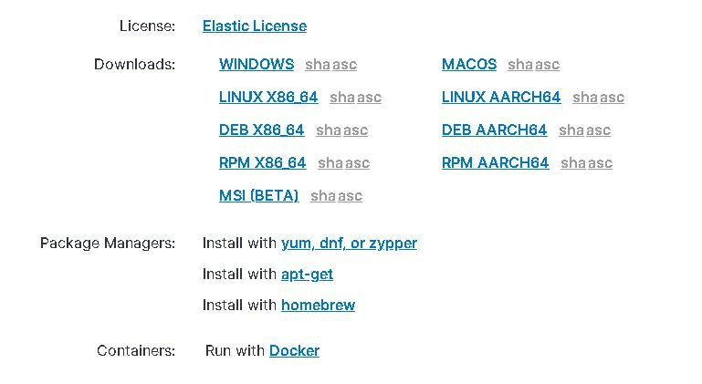
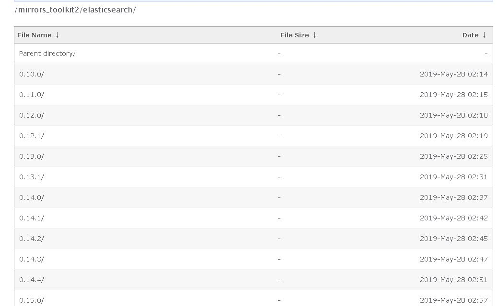
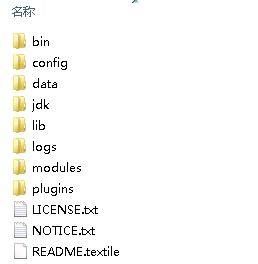
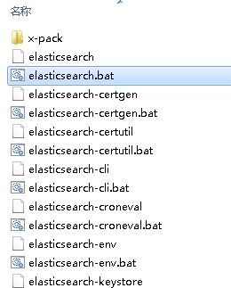
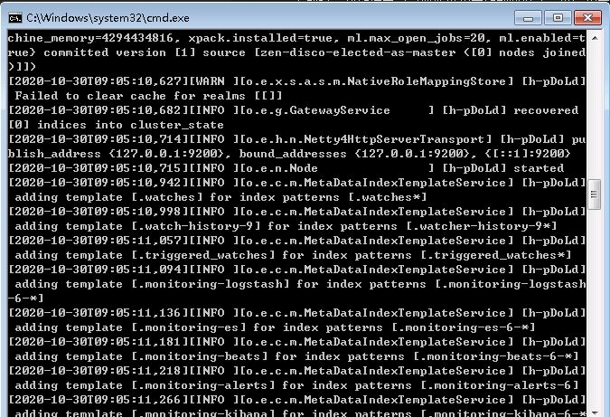
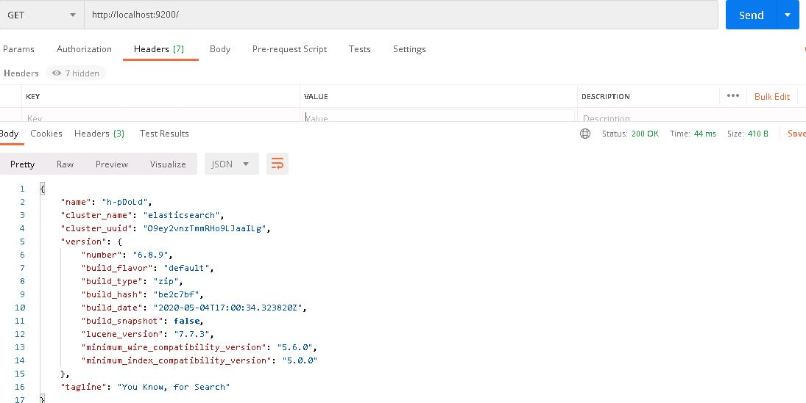

# 安装部署

## 下载
官网下载地址：[Elasticsearch官方下载页](https://www.elastic.co/cn/downloads/elasticsearch)

由于官网网速过慢，运气不好时，很难打开，所以我们可以选择国内的镜像站进行下载。

镜像下载地址：
[Elasticsearch华为云镜像](https://mirrors.huaweicloud.com/elasticsearch/)

下载时，我们按自己习惯选择相应的部署形式，进行相应的下载部署即可。

## 示例

- 以Windows下zip为例，下载后解压zip包。

- 进入bin目录，找到`elasticsearch.bat`，双击执行即可。

- 运行成功后，如下图，可以看到服务已在`9200`端口启动。

- 通过浏览器或者Postman一类的工具，输入`http://localhost:9200`，可以看到Elasticsearch的基本信息。

> 需要注意jdk版本与Elasticsearch的配套关系，当前`7.x.x`版本的Elasticsearch依赖`jdk11`，如果运行时发现提示版本差异，请按提示安装相应版本的jdk即可